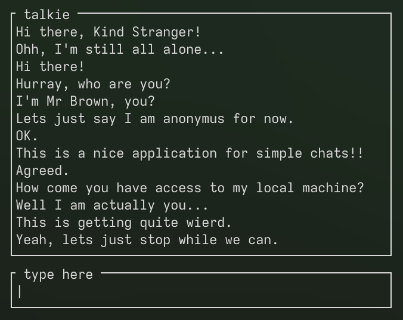
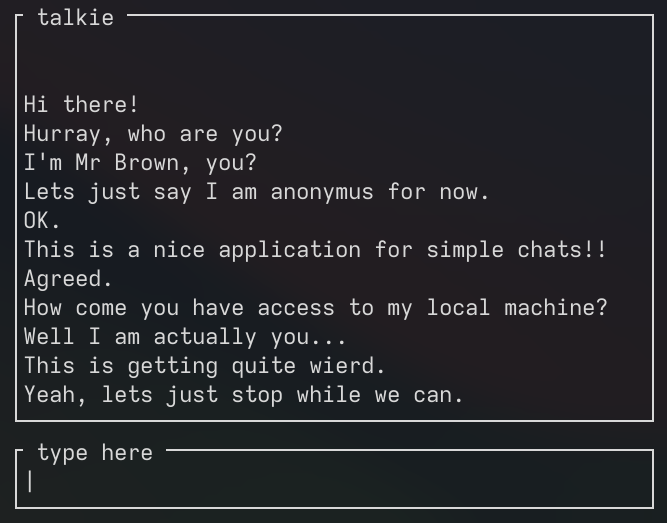

## Build

Talkie depends on [ncwrap](https://github.com/watermeloon1/ncwrap).

    $ make all

## Use

You have to start the talkie `./server` that starts listening on the port `6942` for incoming connections. After that you can start `./client`(s) on localhost. In the future there may be implementation for a full fetched networking system with lobbies and such.

## Pictures




## Logs

```text
❯ ./server
 * LOG: selected port: 6942
 * Waiting for poll...
 * LOG: listening socket is readable.
 * LOG: new incoming connection 4
 * Waiting for poll...
 * LOG: connected socket 4 is readable.
 * REC: from 4 32 bytes.
 * LOG: message: Hi there, Kind Stranger!
 * Waiting for poll...
 * LOG: connected socket 4 is readable.
 * REC: from 4 32 bytes.
 * LOG: message: Ohh, I'm still all alone...
 * Waiting for poll...
 * LOG: listening socket is readable.
 * LOG: new incoming connection 5
 * Waiting for poll...
 * LOG: connected socket 5 is readable.
 * REC: from 5 32 bytes.
 * LOG: message: Hi there!
 * LOG: updating: 4
 * Waiting for poll...
 * LOG: connected socket 4 is readable.
 * REC: from 4 32 bytes.
 * LOG: message: Hurray, who are you?
 * LOG: updating: 5
 * Waiting for poll...
 * LOG: connected socket 5 is readable.
 * REC: from 5 64 bytes.
 * LOG: message: I'm Mr Brown, you?
 * LOG: updating: 4
 * Waiting for poll...
 * LOG: connected socket 4 is readable.
 * REC: from 4 64 bytes.
 * LOG: message: Lets just say I am anonymus for now.
 * LOG: updating: 5
 * Waiting for poll...
 * LOG: connected socket 5 is readable.
 * REC: from 5 32 bytes.
 * LOG: message: OK.
 * LOG: updating: 4
 * Waiting for poll...
 * LOG: connected socket 4 is readable.
 * REC: from 4 64 bytes.
 * LOG: message: This is a nice application for simple chats!!
 * LOG: updating: 5
 * Waiting for poll...
 * LOG: connected socket 5 is readable.
 * REC: from 5 32 bytes.
 * LOG: message: Agreed.
 * LOG: updating: 4
 * Waiting for poll...
 * LOG: connected socket 4 is readable.
 * REC: from 4 64 bytes.
 * LOG: message: How come you have access to my local machine?
 * LOG: updating: 5
 * Waiting for poll...
 * LOG: connected socket 5 is readable.
 * REC: from 5 64 bytes.
 * LOG: message: Well I am actually you...
 * LOG: updating: 4
 * Waiting for poll...
 * LOG: connected socket 5 is readable.
 * REC: from 5 32 bytes.
 * LOG: message: This is getting quite wierd.
 * LOG: updating: 4
 * Waiting for poll...
 * LOG: connected socket 4 is readable.
 * REC: from 4 64 bytes.
 * LOG: message: Yeah, lets just stop while we can.
 * LOG: updating: 5
 * Waiting for poll...
'''
